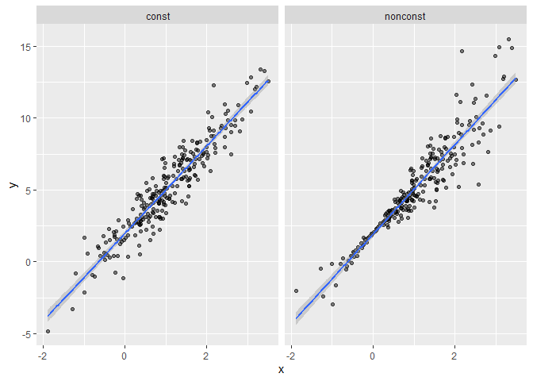

bootstrapping
================
Lucia Wang
2023-11-16

bootstrapping is related to repeated sampling. you draw repeated samples
from original sample with replacement to mimic the repeated samples from
a population.

## generate a relevant sample

``` r
nsamp = 250

sim_df_const = tibble(
  x = rnorm(nsamp, 1, 1),
  error = rnorm(nsamp, 0, 1),
  y = 2 + 3*x + error
)

sim_df_nonconst = sim_df_const |>
  mutate(
    error = error*0.75*x,
    y=2 + 3*x + error
  )

sim_df = 
  bind_rows(const = sim_df_const, nonconst = sim_df_nonconst, .id = "data_source") 

sim_df |> 
  ggplot(aes(x = x, y = y)) + 
  geom_point(alpha = .5) +
  stat_smooth(method = "lm") +
  facet_grid(~data_source) 
```

    ## `geom_smooth()` using formula = 'y ~ x'

<!-- -->

fit linear models

``` r
lm(y ~ x, data = sim_df_const) |> 
  broom::tidy() |> 
  knitr::kable(digits = 3)
```

| term        | estimate | std.error | statistic | p.value |
|:------------|---------:|----------:|----------:|--------:|
| (Intercept) |    1.977 |     0.098 |    20.157 |       0 |
| x           |    3.045 |     0.070 |    43.537 |       0 |

``` r
lm(y ~ x, data = sim_df_nonconst) |> 
  broom::tidy() |> 
  knitr::kable(digits = 3)
```

| term        | estimate | std.error | statistic | p.value |
|:------------|---------:|----------:|----------:|--------:|
| (Intercept) |    1.934 |     0.105 |    18.456 |       0 |
| x           |    3.112 |     0.075 |    41.661 |       0 |

## draw a bootstrap sample

``` r
boot_sample = function(df) {
  sample_frac(df, replace=TRUE)
}
# takes in a df, and returns a sample that is drawn with replacement

sim_df_nonconst |>
  boot_sample() |>
  ggplot(aes(x=x, y=y)) +
  geom_point(alpha=0.5) +
  stat_smooth(method = "lm")
```

    ## `geom_smooth()` using formula = 'y ~ x'

<!-- -->

``` r
# some points are darker bc they show up more than the lighter points
```

## draw a lot of samples and analyze

``` r
boot_straps = 
  tibble(strap_number = 1:100) |> 
  mutate(strap_sample = map(strap_number, \(i) boot_sample(sim_df_nonconst)))

boot_straps |>
  pull(strap_sample) |>
  nth(1) |>
  arrange(x) # to see what is in 1st iteration, etc. samples are different.
```

    ## # A tibble: 250 × 3
    ##         x   error       y
    ##     <dbl>   <dbl>   <dbl>
    ##  1 -1.89   1.62   -2.04  
    ##  2 -1.89   1.62   -2.04  
    ##  3 -1.21  -0.781  -2.43  
    ##  4 -1.21  -0.781  -2.43  
    ##  5 -1.00   0.832  -0.169 
    ##  6 -0.989 -1.97   -2.93  
    ##  7 -0.914 -0.908  -1.65  
    ##  8 -0.606 -0.106   0.0774
    ##  9 -0.536  0.0227  0.413 
    ## 10 -0.524 -0.536  -0.106 
    ## # ℹ 240 more rows

now `lm`: lets analyze them

``` r
#applies LM to all of the bootstrapped samples
boot_results =
  boot_straps |>
  mutate(models = map(strap_sample, \(df) lm(y~x, data=df)),
         results = map(models, broom::tidy)) |> 
  select(strap_number, results) |>
  unnest(results)

boot_results |> 
  group_by(term) |> 
  summarize(boot_se = sd(estimate)) |> 
  knitr::kable(digits = 3)
```

| term        | boot_se |
|:------------|--------:|
| (Intercept) |   0.075 |
| x           |   0.102 |

lets look at the distribution

``` r
boot_results |>
  filter(term=="x") |>
  ggplot(aes(x=estimate)) + geom_density()
```

<!-- -->

``` r
boot_results |> 
  group_by(term) |> 
  summarize(
    ci_lower = quantile(estimate, 0.025), 
    ci_upper = quantile(estimate, 0.975))
```

    ## # A tibble: 2 × 3
    ##   term        ci_lower ci_upper
    ##   <chr>          <dbl>    <dbl>
    ## 1 (Intercept)     1.76     2.06
    ## 2 x               2.97     3.38

``` r
boot_straps |> 
  unnest(strap_sample) |> 
  ggplot(aes(x = x, y = y)) + 
  geom_line(aes(group = strap_number), stat = "smooth", method = "lm", se = FALSE, alpha = .1, color = "blue") +
  geom_point(data = sim_df_nonconst, alpha = .5)
```

    ## `geom_smooth()` using formula = 'y ~ x'

<!-- -->

can also use modelr::bootstrap function

``` r
boot_straps = 
  sim_df_nonconst |> 
  modelr::bootstrap(n = 1000)

boot_straps |> pull(strap) |> nth(1)
```

    ## <resample [250 x 3]> 245, 162, 217, 106, 95, 219, 214, 249, 25, 34, ...

``` r
boot_straps |> pull(strap) |> nth(1) |> as_tibble()
```

    ## # A tibble: 250 × 3
    ##         x  error      y
    ##     <dbl>  <dbl>  <dbl>
    ##  1  2.16   6.18  14.7  
    ##  2  0.761  0.373  4.66 
    ##  3  0.691 -0.366  3.71 
    ##  4  2.77   1.24  11.5  
    ##  5  2.59  -4.39   5.37 
    ##  6  1.64   1.82   8.75 
    ##  7 -0.370 -0.165  0.724
    ##  8  0.834  0.217  4.72 
    ##  9  1.62   0.190  7.05 
    ## 10  0.946 -0.498  4.34 
    ## # ℹ 240 more rows

the rest is the same

## airbnb data again

``` r
data("nyc_airbnb")

nyc_airbnb = 
  nyc_airbnb |> 
  mutate(stars = review_scores_location / 2) |> 
  rename(
    borough = neighbourhood_group,
    neighborhood = neighbourhood) |> 
  filter(borough != "Staten Island") |> 
  drop_na(price, stars) |> 
  select(price, stars, borough, room_type)
```
