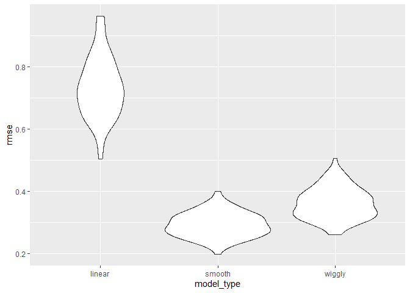

cross validation
================
Lucia Wang
2023-11-14

### notes

model selection is difficult

- nested models have tests
- non-nested do not - balance goodness of fit with “complexity”

questions: is model complex enough? too complex? under/over fitting?
high bias? variances? *will my model generalize to future datasets*?

cross validation - split data into training and testing

- training data to build your model
- testing data to evaluate out-of-sample fit
- ratio depends on data size (jeff likes 80/20)
- evaluate with root mean squared error

refinements and variations

- folding partitions data into equal subsets - one for testing, other
  for training, alternate
- repeat the process - variability in accuracy, find differences in
  models across splits

cross validation is general

- compare candidates that are “traditional” (lasso)
- modern methods? automated variable selection, additive models,
  regression trees

## nonlinear data and cv

``` r
nonlin_df = 
  tibble(
    id = 1:100,
    x = runif(100, 0, 1),
    y = 1 - 10 * (x - .3) ^ 2 + rnorm(100, 0, .3)
  )

nonlin_df |> 
  ggplot(aes(x = x, y = y)) + 
  geom_point()
```

<!-- -->

Do the train/test split

``` r
train_df = sample_n(nonlin_df, 80)
test_df = anti_join(nonlin_df, train_df, by="id")

train_df |> ggplot(aes(x=x, y=y)) +
  geom_point() +
  geom_point(data=test_df, color="red")
```

<!-- -->

about 20 points randomly selected to be in the testing df. there will be
noise (residual error) but if one model is better to predict the red
points after being fit to the black points, maybe that is the best
model.

``` r
linear_model = lm(y~x, data=train_df)

# quick visualization
train_df |> 
  modelr::add_predictions(linear_model) |>
  ggplot(aes(x=x, y=y)) +
  geom_point() +
  geom_line(aes(y=pred))
```

<!-- -->

this model is not that good, the line doesnt really hit any of the
points.

use `mgcv::gam` instead!

``` r
smooth_mod = mgcv::gam(y~s(x), data=train_df)
wiggly = mgcv::gam(y~s(x, k=30), sp=10e-6, data=train_df)

train_df |> 
  add_predictions(smooth_mod) |> 
  ggplot(aes(x = x, y = y)) + geom_point() + 
  geom_line(aes(y = pred), color = "red")
```

<!-- -->

``` r
train_df |> 
  add_predictions(wiggly) |> 
  ggplot(aes(x = x, y = y)) + geom_point() + 
  geom_line(aes(y = pred), color = "red")
```

<!-- -->

lets look at the RMSE

``` r
modelr::rmse(linear_model, train_df)
```

    ## [1] 0.7178747

``` r
modelr::rmse(smooth_mod, train_df)
```

    ## [1] 0.2874834

``` r
modelr::rmse(wiggly, train_df)
```

    ## [1] 0.2498309

the wiggly one seems to be doing the best. what about on the `test_df`?

``` r
modelr::rmse(linear_model, test_df)
```

    ## [1] 0.7052956

``` r
modelr::rmse(smooth_mod, test_df)
```

    ## [1] 0.2221774

``` r
modelr::rmse(wiggly, test_df)
```

    ## [1] 0.289051

the smooth model seems to do better here.

## crossv_mc

this does it multiple times for you

``` r
cv_df = crossv_mc(nonlin_df, 100)

cv_df |> pull(train) |> nth(3) |> as_tibble()
```

    ## # A tibble: 79 × 3
    ##       id     x      y
    ##    <int> <dbl>  <dbl>
    ##  1     1 0.266  1.11 
    ##  2     2 0.372  0.764
    ##  3     3 0.573  0.358
    ##  4     4 0.908 -3.04 
    ##  5     5 0.202  1.33 
    ##  6     6 0.898 -1.99 
    ##  7     7 0.945 -3.27 
    ##  8    11 0.206  1.63 
    ##  9    12 0.177  0.836
    ## 10    13 0.687 -0.291
    ## # ℹ 69 more rows

``` r
cv_df = 
  nonlin_df |>
  crossv_mc(n=100) |>
  mutate(
    train=map(train, as_tibble),
    test=map(test, as_tibble)
  )
```

now we have a ton of training/testing datasets, so lets fit each model
to all training sets and evaluate on all testing sets.

``` r
cv_results = 
  cv_df |>
  mutate(
    linear_fit = map(train, \(df) lm(y~x, data=df)), #anonymous function
    smooth_fit = map(train, \(df) mgcv::gam(y~s(x), data=df)),
    wiggly = map(train, \(df) mgcv::gam(y~s(x, k=30), sp=10e-6, data=df))
  ) |>
  mutate(
    rmse_linear = map2(linear_fit, test, \(mod, df) rmse(mod, df)),
    rmse_smooth = map2(smooth_fit, test, \(mod, df) rmse(mod, df)),
    rmse_wiggly = map2(wiggly, test, \(mod, df) rmse(mod, df))
  )

cv_results |>
  select(starts_with("rmse")) |> 
  pivot_longer(
    everything(),
    names_to = "model_type", 
    values_to = "rmse",
    names_prefix = "rmse_") |> 
  unnest(rmse) |>
   mutate(model = fct_inorder(model_type)) |>
  ggplot(aes(x = model_type, y = rmse)) + 
  geom_violin()
```

<!-- -->

the smooth model does the best (lowest RMSE)
